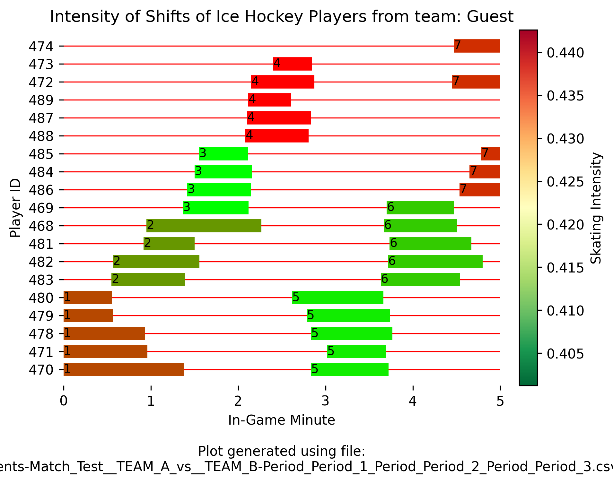
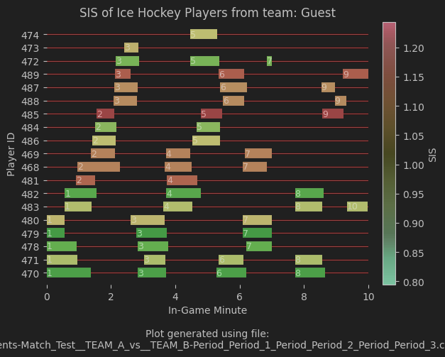
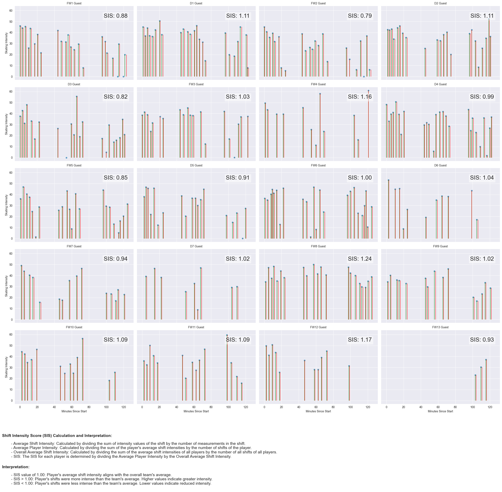

# Swiss Hockey Shift Analysis

This repository contains the codebase for analyzing shift data in swiss ice hockey games to gain insights into the intensity of player shifts. We use event data from the platform kinexon to perform a detailed shift analysis, which then can be used from hockey teams to analyze their game in regards to the shift intensities of the respective players and blocks in a game.

We tried to keep our code as user-friendly as possible. As an example on how to use it and and understand the data, we wrote a jupyter notebook `sample_analysis.iypnb`.


## Repository Structure

### File/Folder Descriptions

**algorithms**
- `utils.py` contains all the more complex functions for the analysis

**data**
- `Events-Match_test__...csv` contains the original event data of a test match provided by the platform kinexon
- `SHIFTS_ONLY_Events-Match_...csv` is a filtered version of the original dataset and only includes the shift event

**images**
- this folder contains the most important plots of the analysis as .png

**playgrounds**
- each member of the project owns an individual jupiter notebook as a playground for his individual drafts, adjustments or tests

`requirements.txt` contains a list of necessary python packages required to run the project.

`sample_analysis` serves as an example showcasing the usage and understanding of the data as well as the underlying analysis


## Installation

We recommend using PyCharm or VS Code to work with the code.

We also assume that you have some version of Python installed. We developed using Python 3.10, but other versions should work as well.

### Quickstart

1. Clone the repository to your local machine.
2. Open the repository in your IDE.
3. Create and activate a virtual environment (optional but we strongly recommend it)
    - Creation: Run `python -m venv venv` in the terminal
    - Activation: 
      - Windows: Run `.\venv\Scripts\activate` in the terminal
      - Unix: Run `source ./venv/bin/activate` in the terminal (we think, not actually tested)
    - (Deactivation, if necessary: Run `deactivate` in the terminal)
4. Install the required packages by running `pip install -r requirements.txt` in the terminal.
5. You are ready to go.

## Reading data

There are two ways to load data. 

### Manual Download

Download event-data from kinexon. In the process, select all columns you want to analyse. This data will have the following format:

```csv
"Timestamp (ms)";"Timestamp in local format";"Player ID";Name;"Event type"
;;;;"Changes of Direction";"Magnitude (°)";"Skating Deceleration (Max.) (m/s²)";"Skating Acceleration (Max.) (m/s²)";"Direction (left/right)"
;;;;"Down on Pads";"Impact (g)";"Time (ms)"
;;;;Hits;"Magnitude (g)";"Speed (km/h)"
;;;;"Hockey Exertions";"Duration (s)";"Hockey Load / min";"Hockey Load (max.)";"Distance (m)";"Speed (max.) (km/h)";"Hockey Exertion"
;;;;Shifts;"Duration (s)";Distance;"Distance (speed | Very low)";"Distance (speed | Low)";"Distance (speed | Medium)";"Distance (speed | High)";"Distance (speed | Very high)";"Distance (speed | Sprint)";"Distance (speed | 0 - 0 km/h)";"Metabolic Power (Ø)";"Speed (max.)";"Skating Load";"Skating Intensity"
;;;;"Skating Accelerations";"Duration (s)";"Distance (m)";"Speed (max.) (km/h)";"Skating Acceleration (Max.) (m/s²)";"Skating Acceleration (Ø) (m/s²)";"Speed Change (km/h)";"Acceleration Category"
;;;;"Skating Bursts";"Duration (s)";"Distance (m)";"Speed (max.)";"Skating Acceleration (Max.) (m/s²)";"Skating Bursts"
;;;;"Skating Decelerations";"Duration (s)";"Distance (m)";"Speed (max.) (km/h)";"Skating Deceleration (Max.) (m/s²)";"Skating Deceleration (Ø) (m/s²)";"Speed Change (km/h)";"Deceleration Category"
;;;;"Skating Transitions";"Body Rotation (°)";"Previous Speed (km/h)";"Following Speed (km/h)";"Direction (left/right)"
;;;;Sprints;"Duration (s)";"Distance (m)";"Speed (max.) (km/h)";"Speed (Ø) (km/h)";"Sprint category"
;;;;Turns;"Duration (s)";"Radius (m)";"Angle (°)";"Direction (left/right)";"End Speed (km/h)";"Start Speed (km/h)";"Turn category"
[... actual data ...]
```

Our function `utils.read_file(file_name, event_type)` will import this CSV file and return a dataframe.
In our case, `event_type` is "Shifts". The function will dismiss all other lines starting with `;;;;` and read the correct columns for the chosen event type.

Alternatively, the CSV file can be edited manually to have following format:

````csv
"Timestamp (ms)";"Timestamp in local format";"Player ID";Name;"Event type";"Duration (s)";Distance;"Distance (speed | Very low)";"Distance (speed | Low)";"Distance (speed | Medium)";"Distance (speed | High)";"Distance (speed | Very high)";"Distance (speed | Sprint)";"Distance (speed | 0 - 0 km/h)";"Metabolic Power (Ø)";"Speed (max.)";"Skating Load";"Skating Intensity"
````

This enables you to read the data with a simple `pandas.read_csv(file_name)`.

### Automatic download from API

Create a JSON file with following content. Then use `utils.read_file_web()`, supplying the path to the file, to download the data as dataframe.

````json
{
    "API_KEY" : "insert_some_api_key",
    "USER" : "insert_username_to_access_page",
    "PASSWORD" : "insert_passwort_to_accesss_page"
}
````
- API_KEY = api key to access the database
- USER = username to access the website kinexon.com. **NOT** the username to login to kinexon.com
- PASSWORD = password to access the webstie kinexon.com. **NOT** the password to login to kinexon.com.

*Hint:* Does not yet work very well.

## Plotting

### Create Shifts and Plot them

To create shifts and plot them, use `utils.plot_shifts_with_intensity()`.

This function requires the dataframe to plot and a block_config. The block_config is an algorithm configuration, which specifies how to search for shifts, whether you want verbose information, a team name, file name for labelling the plot and an option to save the plots to PNG. 

To simplify the creation of the block_config, we provide a function `utils.generate_block_config()`.

This is an example for the shifts, generated from `sample_analysis.ipynb`:




### Shift intensity score (SIS)

To analyze skating intensity and visualize the results for specific players, use  `utils.plot_SIS()` or `utils.plot_skating_intensity()`.





For an interactive preview of the plots, see [plot_SIS](https://dataunionsihf-qs7vheczgfcx6tu48tvuzc.streamlit.app/) or [plot_skating_intensity](https://dataunionsihf-jpqzzukaaio3dufjbos9wm.streamlit.app/).

This functions require a preprocessed DataFrame and parameters for player selection and the time window of interest. The DataFrame should include columns for `'Timestamp (ms)', 'Name', 'Skating Intensity', 'End Timestamp', and 'Readable Timestamp'`.

**Quick Setup**
- **Prepare your data** with `utils.read_file(FILE, EVENT_TYPE)` to load player shift events from a CSV file.
- **Calculate the Shift Intensity Score (SIS)** for each player by adding an SIS column to your DataFrame with `utils.add_sis_column(df)`.
- **Select players and set the time window** for analysis. Example: Select players named "Guest" and set a time window from 0 to 130 minutes.
- **Plot the intensity** with `utils.plot_skating_intensity(df_with_sis, selected_players, start_time, end_time)` to visualize skating intensity over time, excluding goalkeepers.

For a step-by-step guide and examples on how to use these functions, refer to `sample_analysis.ipynb`.

## Understanding Shift Intensity Score (SIS)

The Shift Intensity Score (SIS) is a pivotal metric derived from skating intensity data, providing insights into a player's performance by comparing their shift intensity with the team's average. Below is the methodology for calculating SIS and its implications for performance analysis.

### SIS Calculation Steps

1. **Average Shift Intensity:** Calculate the average intensity for each player's shift by summing up the intensity values during a shift and dividing by the number of measurements within that shift.

   

2. **Average Player Intensity:** Determine the average intensity across all shifts for each player by summing the average intensities of all shifts for a player and dividing by the total number of shifts.

   

3. **Overall Average Shift Intensity:** Calculate the team-wide average intensity by summing the average shift intensities of all players and dividing by the total number of shifts across all players.

   

4. **Shift Intensity Score (SIS):** Finally, determine the SIS for each player by dividing their average player intensity by the overall average shift intensity.

   

### Interpretation of SIS

- **SIS Value of 1.00:** Indicates the player's average shift intensity aligns exactly with the team's overall average.
- **SIS Greater Than 1.00:** Signifies that the player's shifts were more intense than the team's average intensity, suggesting higher performance or exertion levels.
- **SIS Less Than 1.00:** Implies the player's shifts were less intense than the team's average intensity, suggesting lower performance or exertion levels.

### Practical Applications

- **Performance Assessment:** Utilizing SIS helps in identifying players with higher or lower intensity levels, offering insights into their contributions during games.
- **Recovery Strategies:** Players with higher SIS values might require more recovery time due to their higher exertion levels.
- **Training Adjustments:** SIS can guide the adjustments in training workloads to optimize both individual and team performance.

Leveraging SIS allows coaches and trainers to make informed decisions to enhance team strategy and player development.
